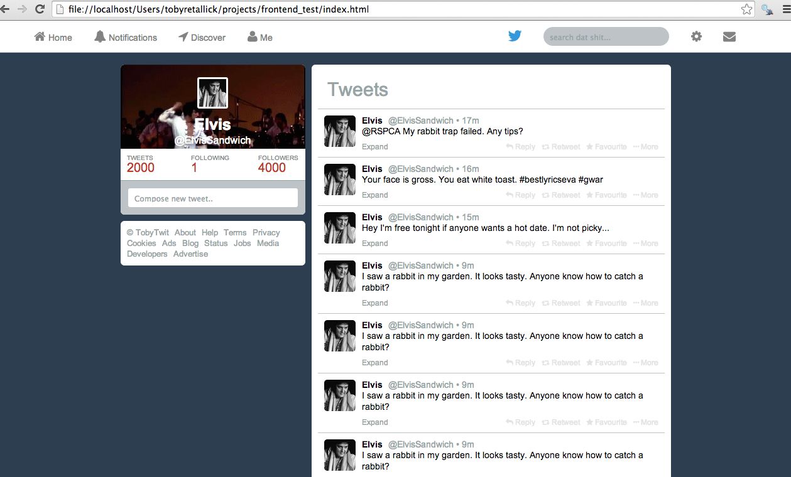

#Makers Academy Week 7: Frontman Test

I was required to recreate Twitter's front end using HTML, CSS and JQuery. The resulting site also includes an infinite scroll - new tweets are populated on the page as you scroll down.

